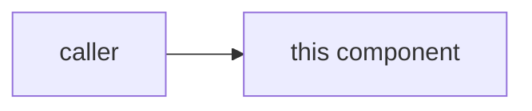

## Purpose

Why this component exists, in 2–3 sentences.

## Interface

How the rest of the system talks to it (API surface, events, schema).

## Internals

## Dependencies

What it depends on, and what depends on it.

## Decisions that shaped this

- ADR-NNNN — why it applies here.
