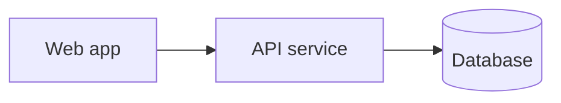

## Container diagram

<!-- One node per deployable/runnable unit (service, worker, datastore, SPA).
     Anything finer-grained belongs in a design doc under designs/. -->

## Containers

- **API service** — responsibility, runtime, where it lives in the repo.
- **Database** — what it stores, who reads/writes it.
