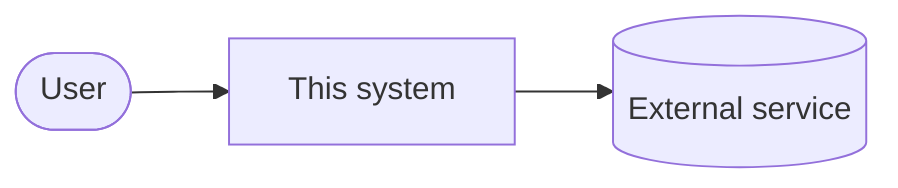

## Context diagram

<!-- Replace with your real actors and external systems. Keep this at black-box
     altitude: if it has an internal module name in it, it belongs in containers.md. -->

## Actors

- **User** — who they are, what they need from the system.

## External systems

- **External service** — what we use it for, who owns the integration.
